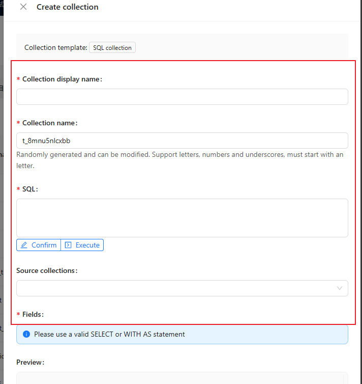

# CollectionTemplate

Template used for creating data tables.


```ts
interface AvailableFieldInterfacesInclude {
  include?: any[];
}

interface AvailableFieldInterfacesExclude {
  exclude?: any[];
}

interface CollectionTemplateDefaultOptions {
  /**
   * Auto-generate id
   * @default true
   * */
  autoGenId?: boolean;
  /** Created by */
  createdBy?: boolean;
  /** Updated by */
  updatedBy?: boolean;
  /** Created at */
  createdAt?: boolean;
  /** Updated at */
  updatedAt?: boolean;
  /** Sortable */
  sortable?: boolean;
  /* Tree structure */
  tree?: string;
  /* Logging */
  logging?: boolean;
  /** Inherits */
  inherits?: string | string[];
  /* Field list */
  fields?: CollectionOptions['fields'];
}

class CollectionTemplate {
  app: Application;
  collectionManager: CollectionManager;

  name: string;
  Collection?: typeof Collection;
  transform?: (collection: CollectionOptions, app: Application) => CollectionOptions;
  title?: string;
  color?: string;
  /** Order */
  order?: number;
  /** Default configuration */
  default?: CollectionTemplateDefaultOptions;
  events?: any;
  /** UI configurable CollectionOptions parameters (fields in the form for adding or editing Collection) */
  configurableProperties?: Record<string, ISchema>;
  /** Available field interfaces for the current template */
  availableFieldInterfaces?: AvailableFieldInterfacesInclude | AvailableFieldInterfacesExclude;
  /** Divider */
  divider?: boolean;
  /** Template description */
  description?: string;
  /** Configure actions in the configuration fields */
  configureActions?: Record<string, ISchema>;
  // Whether to forbid field deletion
  forbidDeletion?: boolean;
}
```

It needs to be used in conjunction with [CollectionManager](./collection-template-manager.md).

```ts
import { Plugin, Collection, CollectionTemplate } from '@nocobase/client';

class SqlCollection extends Collection {
  otherMethods() {
    // ...
  }
}

class SqlCollectionTemplate extends CollectionTemplate {
  name = 'sql';
  Collection = SqlCollection; // 自定义的数据表类
  title = '{{t("SQL collection")}}';
  order = 4;
  color = 'yellow';
  default = {
    fields: [],
  };
  configurableProperties = {
    // ...
  }
}

class MyPlugin extends Plugin {
  async load() {
    this.app.dataSourceManager.collectionTemplateManager.addCollectionTemplates([ SqlCollectionTemplate ]);

    // or
    this.app.dataSourceManager.addCollectionTemplates([ SqlCollectionTemplate ]);
  }
}
```

## Instance Properties

### name

The unique identifier of the template.


### Collection

The data table class corresponding to the template.

After creating a data table, the Collection will have a [template field](/core/data-source/collection#collectionoptions) to identify which template the data table was created from.

When adding data table objects through `collectionManager.addCollections()`, it first reads the `collection.template` field, and then retrieves the `collectionTemplate` through `collectionManager.getCollectionTemplate(collection.template)`.

It reads the `collectionTemplate.Collection` field and creates the corresponding instance through `new collectionTemplate.Collection(collection)`.

If `Collection` is not passed, it creates the corresponding instance through `new Collection(collection)`.

```ts
class SqlCollection extends Collection {
  otherMethods() {
    // ...
  }
}

class SqlCollectionTemplate extends CollectionTemplate {
  name = 'sql';
  Collection = SqlCollection; // 自定义的数据表类
  // ...
}

const userCollection = {
  name: 'users',
  template: 'sql',
  // ...
}

// 内部会调用 new SqlCollection(userCollection)
```

### title

The title of the template.

### color

The color of the template.

### order

The order of the template.

### events

- `beforeSubmit`: Triggered before submission.

### configurableProperties

Form configuration items.



```ts
class SqlCollectionTemplate extends CollectionTemplate {
  name = 'sql',
  // ...
  configurableProperties = {
    title: {
      type: 'string',
      title: '{{ t("Collection display name") }}',
      required: true,
      'x-decorator': 'FormItem',
      'x-component': 'Input',
    },
    name: {
      type: 'string',
      title: '{{t("Collection name")}}',
      required: true,
      'x-disabled': '{{ !createOnly }}',
      'x-decorator': 'FormItem',
      'x-component': 'Input',
      'x-validator': 'uid',
      description:
        "{{t('Randomly generated and can be modified. Support letters, numbers and underscores, must start with an letter.')}}",
    },
    // ...
  },
}
```

### default

Default form values.

## Instance Methods

### collectionTemplate.transform(collection)

After creating a collection, this method is called to transform the collection.

## Utils

### getConfigurableProperties()

Used to retrieve built-in configurable property fields.

- Type

```tsx | pure
export type DefaultConfigurableKeys =
  | 'name'
  | 'title'
  | 'inherits'
  | 'category'
  | 'autoGenId'
  | 'createdBy'
  | 'updatedBy'
  | 'createdAt'
  | 'updatedAt'
  | 'sortable'
  | 'description'
  | 'moreOptions';

const getConfigurableProperties: (...keys: DefaultConfigurableKeys[]) => Record<DefaultConfigurableKeys, any>
```

- Example

```tsx | pure
import { getConfigurableProperties } from '@nocobase/client';

const sqlCollectionTemplate = new CollectionTemplate({
  name: 'sql',
  // ...
  configurableProperties: {
    ...getConfigurableProperties('name', 'title', 'description'),
    // ...
  },
});
```
